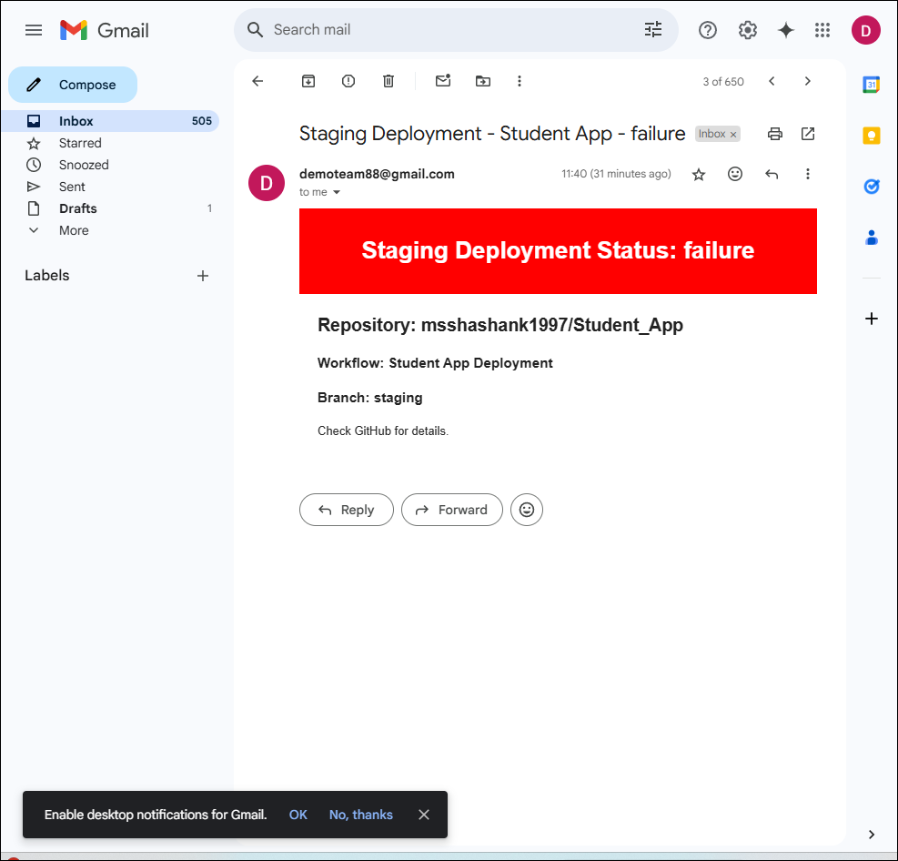
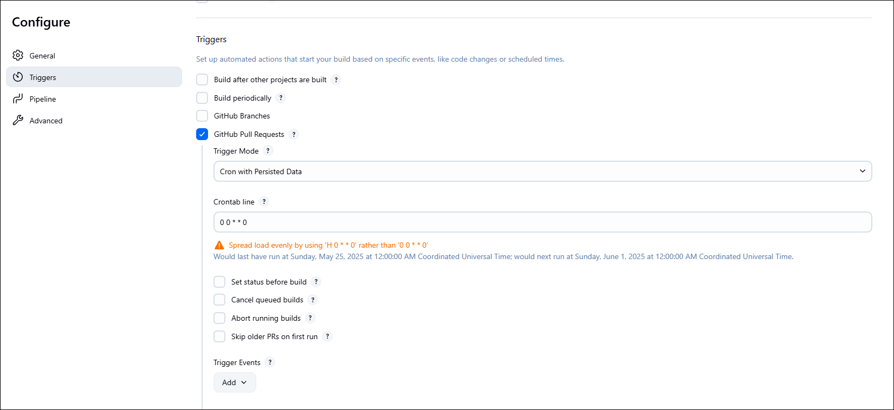
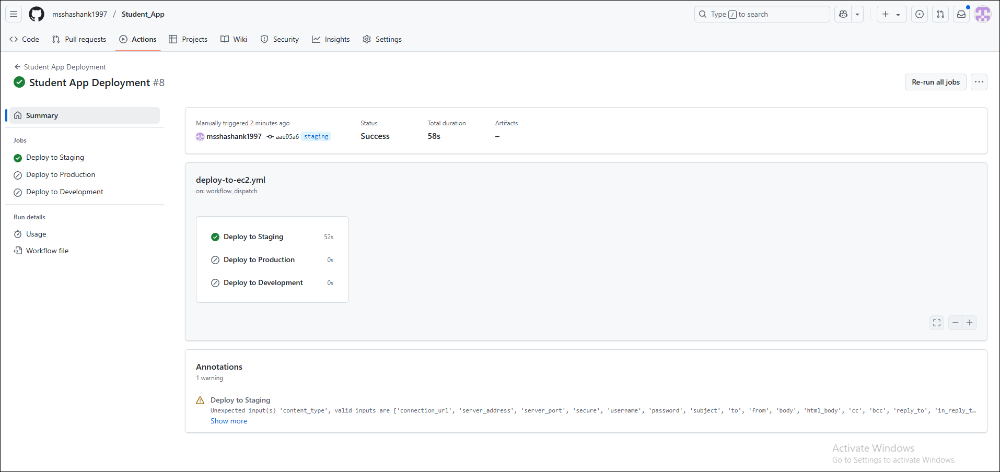
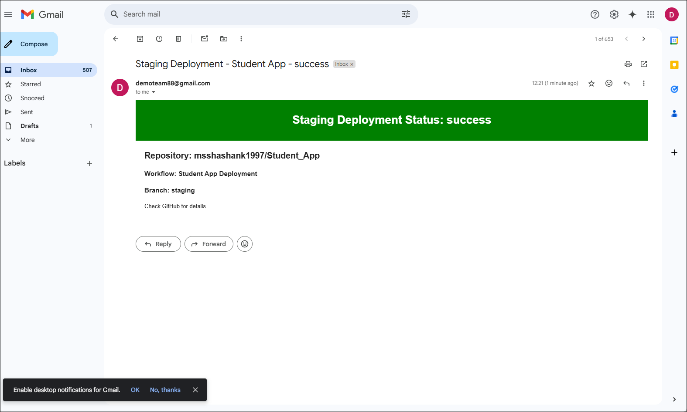
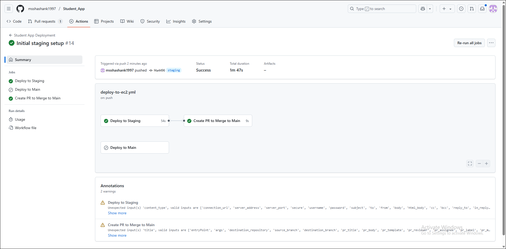
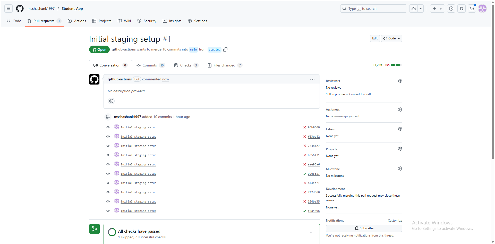
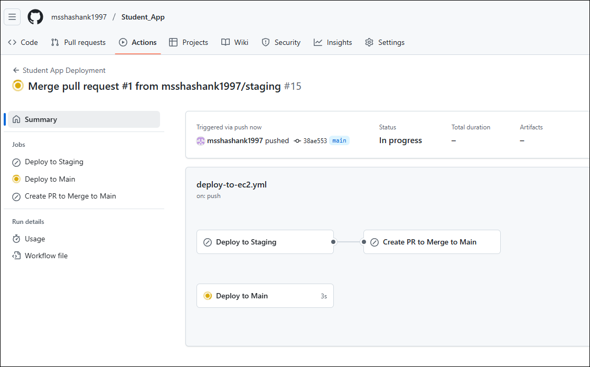

# Student Management System (Flask + Pytest + Jenkins + Docker)

A web application for managing student records using Flask and MongoDB.

## 📌 Features
- Add, view, fetch, and delete students
- REST API with Flask
- Tested with pytest
- Dockerized
- CI/CD ready with Jenkins
- Email notifications via SMTP

## 🚀 Run Locally
```bash
pip install -r requirements.txt
python app.py
```

## 🧪 Run Tests
```bash
pytest test_app.py
```

## 🐳 Docker
```bash
docker build -t student-api .
docker run -p 5000:5000 student-api
```

# 1. Jenkins CI CD pipeline for flask application

## 🛠️ Jenkins Pipeline
This project contains a `Jenkinsfile` to automate:
- Code clone
- Dependency install
- Test execution
- Docker image build and push
- App deployment
- SMTP email notifications for build status

## Generate App passwords

- Navigate to https://myaccount.google.com/apppasswords
- Sign in to your Google Account
- Select the app (Mail) and device (Other - custom name)
- Enter a name for the app password (e.g., "Student App SMTP")
- Click "Generate"
- Use the generated 16-character password in your application's SMTP configuration
- Note: App passwords are only available if you have 2-Step Verification enabled for your Google account

## 📧 SMTP Configuration
The application supports email notifications for various events:
- Configure SMTP settings in the environment variables
- Emails are sent for student registration and account activities
- Build status notifications from Jenkins pipeline

## Create and run Jenkins file

### Create a Jenkinsfile

1. Create a new pipeline

    ```
    pipeline {
        agent any

        environment {
            GITREPO = "https://github.com/msshashank1997/Student_App.git"
            EC2_IP = "IP" # replace EC2 Public IP
            EC2_USERNAME = "ubuntu" # EC2 instance username
            EC2_ID = "shashankec2" # Replace with 
        }

        stages {
            stage('Clone Repo') {
                steps {
                    git url: "${GITREPO}", branch: 'main'
                }
            }

            stage('Copy Files to EC2') {
                steps {
                    sshagent(credentials:["${env.EC2_ID}"]) {
                        sh """
                        scp -o StrictHostKeyChecking=no -r * ${env.EC2_USERNAME}@${env.EC2_IP}:/home/ubuntu/application
                        """
                    }
                }
            }
            
            stage('EC2 System Updates') {
                steps {
                    sshagent(credentials:["${env.EC2_ID}"]) {
                        sh """
                        ssh -o StrictHostKeyChecking=no ${env.EC2_USERNAME}@${env.EC2_IP} '
                            sudo apt update
                            sudo apt install -y python3
                            sudo apt install -y python3-pip
                            sudo apt install -y npm
                            cd /home/ubuntu/application
                            sudo chmod -R 777 *
                        '
                        """
                    }
                }
            }
            
            stage('Install Docker') {
                steps {
                    sshagent(credentials:["${env.EC2_ID}"]) {
                        sh """
                        ssh -o StrictHostKeyChecking=no ${env.EC2_USERNAME}@${env.EC2_IP} '
                            sudo apt install -y docker.io
                            sudo systemctl start docker
                            sudo systemctl enable docker
                            sudo gpasswd -a \$USER docker
                        '
                        """
                    }
                }
            }

            stage('Install Python Dependencies') {
                steps {
                    sshagent(credentials: ["${env.EC2_ID}"]) {
                        sh """
                        ssh -o StrictHostKeyChecking=no ${env.EC2_USERNAME}@${env.EC2_IP} '
                            cd /home/ubuntu/application
                            # Install Python venv package
                            sudo apt install -y python3-venv python3-full
                            # Create a virtual environment
                            python3 -m venv venv
                            # Activate virtual environment and install dependencies
                            source venv/bin/activate
                            pip install -r requirements.txt
                        '
                        """
                    }
                }
            }

            stage('Build Docker Image') {
                steps {
                    sshagent(credentials: ["${env.EC2_ID}"]) {
                        sh """
                        ssh -o StrictHostKeyChecking=no ${env.EC2_USERNAME}@${env.EC2_IP} '
                            cd /home/ubuntu/application
                            # Make sure docker-compose is installed
                            if ! command -v docker-compose &> /dev/null; then
                                echo "docker-compose not found, installing..."
                                sudo apt-get update
                                sudo apt-get install -y docker-compose
                            fi
                            
                            # Check if port 27017 is in use by any process
                            if sudo lsof -i :27017 | grep LISTEN; then
                                echo "Port 27017 is already in use. Stopping existing process..."
                                # Find container using port 27017
                                CONTAINER_ID=\$(sudo docker ps -q --filter "publish=27017")
                                if [ ! -z "\$CONTAINER_ID" ]; then
                                    echo "Stopping Docker container using port 27017..."
                                    sudo docker stop \$CONTAINER_ID
                                else
                                    # If not a Docker container, find and kill the process
                                    PID=\$(sudo lsof -t -i:27017)
                                    if [ ! -z "\$PID" ]; then
                                        echo "Killing process \$PID that is using port 27017..."
                                        sudo kill -9 \$PID
                                    fi
                                fi
                            fi
                            
                            # Stop any existing containers managed by docker-compose
                            sudo docker-compose down
                            
                            # Start containers in detached mode
                            sudo docker-compose up -d
                            
                            # Verify MongoDB container is running
                            if ! sudo docker ps | grep mongo-studentdb; then
                                echo "Error: MongoDB container failed to start"
                                exit 1
                            fi
                        '
                        """   
                    }
                }
            }

            stage('Run Flask App') {
                steps {
                    sshagent(credentials: ["${env.EC2_ID}"]) {
                        sh """ 
                        ssh -o StrictHostKeyChecking=no ${env.EC2_USERNAME}@${env.EC2_IP} '
                            cd /home/ubuntu/application
                            # if docker continer is running and image is built, then run the app
                            if sudo docker ps | grep stuident-app; then
                                echo "Docker container for stuident-app is already running."
                                # stop container if it is running
                                sudo docker stop stuident-app || echo "Failed to stop existing container"
                                sudo docker rm stuident-app || echo "Failed to remove existing container"
                            else
                                echo "Starting Docker container for stuident-app..."
                                sudo docker build -t stuident-app:latest .
                                sudo docker run -d -p 5000:5000 stuident-app:latest
                            fi
                        '
                        """
                    }
                }
            }

                    
            stage('Seed Database') {
                steps {
                    sshagent(credentials: ["${env.EC2_ID}"]) {
                        sh """
                        ssh -o StrictHostKeyChecking=no ${env.EC2_USERNAME}@${env.EC2_IP} '
                            cd /home/ubuntu/application
                            sudo npm install
                            sudo npm run import
                            '
                            """
                            }
                        }
                    }

            stage('Run Tests') {
                steps {
                    sshagent(credentials: ["${env.EC2_ID}"]) {
                        sh """
                        ssh -o StrictHostKeyChecking=no ${env.EC2_USERNAME}@${env.EC2_IP} '
                            cd /home/ubuntu/application 
                            source venv/bin/activate
                            
                            # Run tests and capture exit code
                            pytest test_app.py --maxfail=1 --disable-warnings -q
                            TEST_EXIT_CODE=\$?
                            
                            # If tests failed, stop services
                            if [ \$TEST_EXIT_CODE -ne 0 ]; then
                                echo "Tests failed. Stopping services..."
                                # Stop Docker containers
                                sudo docker-compose down
                                
                                # Stop the Flask application running with Gunicorn on port 5000
                                echo "Stopping Flask application on port 5000..."
                                # Find processes using port 5000
                                PORT_PIDS=\$(lsof -t -i:5000 || echo "")
                                if [ ! -z "\$PORT_PIDS" ]; then
                                    echo "Killing processes using port 5000: \$PORT_PIDS"
                                    kill -9 \$PORT_PIDS || echo "Failed to kill some processes"
                                fi
                                
                                # Also try to find gunicorn processes as a fallback
                                GUNICORN_PIDS=\$(pgrep gunicorn || echo "")
                                if [ ! -z "\$GUNICORN_PIDS" ]; then
                                    echo "Killing gunicorn processes: \$GUNICORN_PIDS"
                                    kill -9 \$GUNICORN_PIDS || echo "Failed to kill some gunicorn processes"
                                fi
                                
                                # Verify port is free
                                if lsof -i:5000 >/dev/null 2>&1; then
                                    echo "WARNING: Port 5000 is still in use after cleanup attempt"
                                else
                                    echo "Port 5000 successfully released"
                                fi
                                
                                # Log the failure for debugging
                                echo "\$(date): Tests failed, all services stopped" >> /home/ubuntu/application/deployment_log.txt
                            else
                                echo "Tests passed successfully. Services remain running."
                            fi
                            
                            # Return the original exit code to propagate test failure to Jenkins
                            exit \$TEST_EXIT_CODE
                        '
                        """
                    }
                }
            }
        }
        
        post {
            always {
                script {
                    def jobName = env.JOB_NAME
                    def buildNumber = env.BUILD_NUMBER
                    def pipelineStatus = currentBuild.result ?: 'unknown'
                    def banner = pipelineStatus.toUpperCase() == 'SUCCESS' ? 'green' : 'red'

                    def reportHtml = """<html>
                        <head>
                            <style>
                                body { font-family: Arial, sans-serif; }
                                .banner { background-color: ${banner}; color: white; padding: 10px; text-align: center; }
                                .content { margin: 20px; }
                            </style>
                        </head>
                        <body>
                            <div class="banner">
                                <h1>Pipeline Status: ${pipelineStatus}</h1>
                            </div>
                            <div class="content">
                                <h2>Job Name: ${jobName}</h2>
                                <h3>Build Number: ${buildNumber}</h3>
                                <p>Check the Thivy report for details.</p>
                            </div>
                        </body>
                        </html>"""
                    emailext(
                        subject: "Jenkins Pipeline: ${jobName} - Build #${buildNumber} - ${pipelineStatus}",
                        body: reportHtml,
                        mimeType: 'text/html',
                        to: 'demoteam88@gmail.com',
                        from: 'demoteam88@gmail.com',
                        replyTo: 'demoteam88@gmail.com'
                    )
                }
            }
        }
    }
    ```

### Running Jenkins Pipeline

1. In Jenkins dashboard, select "New Item" and choose "Pipeline"
2. Configure the pipeline to use your Git repository
3. Under "Pipeline", select "Pipeline script from SCM"
4. Choose Git as SCM and enter your repository URL
5. Specify the branch and path to Jenkinsfile
6. Click "Save" and "Build Now" to run the pipeline

### What Happens in EC2 After Execution

When the Jenkinsfile runs successfully, the following actions are performed on the EC2 instance:

1. **Code Deployment**
   - Application code is copied to `/home/ubuntu/application` directory
   - File permissions are set to ensure proper access

2. **System Setup**
   - System packages are updated via `apt update`
   - Python 3, pip, and npm are installed
   - Docker is installed and configured to start on boot
   - Current user is added to the Docker group for access

3. **Application Setup**
   - Python virtual environment is created
   - All dependencies from requirements.txt are installed
   - Docker and docker-compose are configured

4. **Container Management**
   - Any processes using MongoDB's port (27017) are stopped
   - Existing Docker containers are stopped with `docker-compose down`
   - New containers are launched with `docker-compose up -d`
   - MongoDB container starts and is verified

5. **Application Deployment**
   - Flask application is built into a Docker image
   - Application container is launched on port 5000
   - Database is seeded with initial data via npm scripts

6. **Testing**
   - Automated tests run against the live application
   - If tests fail, services are automatically stopped
   - Test results determine pipeline success/failure

     

7. **Notification**
   - Email notification is sent with build status

     

8. **Weekly Automated Maintenance**
   - A cron job is set up to run weekly maintenance tasks
   - Schedule: Every Sunday at midnight (`0 0 * * 0`)
   - To set up this cron job on EC2:

     
     
     

## API Endpoints

- `GET` `/api/students` - Get all students
- `POST` `/api/students` - Add a new student
- `GET` `/api/students/<student_id>` - Get student by ID
- `DELETE` `/api/students/<student_id>` - Delete student
- `GET` `/api/students/name/<name>` - Search students by name

## Web Pages

- `/` - Home page
- `/web/students` - View all students
- `/web/add_student` - Add a new student


# 2. GitHub Actions CI/CD Pipeline Flask App

## 🔄 GitHub Actions Workflow
This project can also be configured with GitHub Actions to automate:
- Code testing
- Docker image building
- Continuous deployment
- Automated notifications

## Setting up GitHub Actions

### Create a workflow file

1. Create `.github/workflows/flask-app-ci.yml` in your repository:

msshashank1997: if work flow succedd need command to push changes from stage to main and trigger main

GitHub Copilot: # Automating Promotion from Staging to Main Branch

To push changes from your staging branch to the main branch after a successful workflow run, you can add an automated promotion step to your GitHub Actions workflow. Here's how to set it up:

## Add Promotion Job to Your Workflow

Add this job to your `.github/workflows/flask-app-ci.yml` file:

```yaml
promote-to-production:
  needs: [deploy-to-staging]  # This should be the name of your staging deployment job
  if: github.ref == 'refs/heads/staging' && success()  # Only run if staging workflow succeeded
  runs-on: ubuntu-latest
  steps:
    - name: Checkout code
      uses: actions/checkout@v3
      with:
        fetch-depth: 0  # Important to fetch all history for merging

    - name: Configure Git
      run: |
        git config --global user.name 'GitHub Actions'
        git config --global user.email 'actions@github.com'
    
    - name: Merge staging into main
      run: |
        git fetch origin
        git checkout main
        git pull origin main
        git merge --no-ff origin/staging -m "Auto-merge staging to main after successful deploy"
        git push origin main
    
    - name: Trigger main workflow
      uses: peter-evans/repository-dispatch@v2
      with:
        token: ${{ secrets.GITHUB_TOKEN }}
        event-type: promote-to-main
        repository: ${{ github.repository }}
```

## Enable Workflow Triggering on Main

Then, make sure your main branch workflow can be triggered by this event by adding to its triggers:

```yaml
on:
  push:
    branches: [ main ]
  repository_dispatch:
    types: [promote-to-main]
```

## Required Permissions

For this to work, you need to:

1. Make sure your workflow has proper write permissions to the repository
2. In your repository settings, go to Settings → Actions → General → Workflow permissions
3. Select "Read and write permissions"

This approach automatically merges staging to main after successful staging deployment, then triggers your main branch workflow.

msshashank1997: same repo 

GitHub Copilot: # GitHub Actions Branch Promotion Configuration

I see you've implemented the promotion job in your workflow file. There's a potential issue with your current configuration that needs addressing:

## Issue: Workflow Trigger vs Job Condition

There's a mismatch between:
- Your workflow is triggered on pushes to `main` and repository_dispatch events
- Your promotion job runs only on the `staging` branch (`if: github.ref == 'refs/heads/staging'`)

This means the promotion job will never run because the workflow itself only triggers on main branch activity.

## Solution: Create Two Separate Workflows

### 1. First workflow (staging.yml):
```yaml
name: Staging Deployment

on:
  push:
    branches: [staging]
  workflow_dispatch:

jobs:
  # Your test job here
  
  # Your build job here
  
  deploy-to-staging:
    # Your staging deployment steps
    # ...
    
  promote-to-production:
    needs: [deploy-to-staging]
    if: success()
    runs-on: ubuntu-latest
    steps:
      - name: Checkout code
        uses: actions/checkout@v3
        with:
          fetch-depth: 0
          
      - name: Configure Git
        run: |
          git config --global user.name 'GitHub Actions'
          git config --global user.email 'actions@github.com'
      
      - name: Merge staging into main
        run: |
          git fetch origin
          git checkout main
          git pull origin main
          git merge --no-ff origin/staging -m "Auto-merge staging to main after successful deploy"
          git push origin main
      
      - name: Trigger main workflow
        uses: peter-evans/repository-dispatch@v2
        with:
          token: ${{ secrets.REPO_ACCESS_TOKEN }}
          event-type: promote-to-main
          repository: ${{ github.repository }}
```

### 2. Second workflow (main.yml):
```yaml
name: Production Deployment

on:
  push:
    branches: [main]
  repository_dispatch:
    types: [promote-to-main]

jobs:
  deploy-to-production:
    runs-on: ubuntu-latest
    steps:
      # Your production deployment steps here
```

## Important Note About Permissions:

The default `GITHUB_TOKEN` doesn't have permissions to trigger other workflows. You'll need to:

1. Create a Personal Access Token with `repo` scope
2. Save it as a repository secret named `REPO_ACCESS_TOKEN` 
3. Use this token instead of `GITHUB_TOKEN` in the repository-dispatch action

This setup properly separates your staging and production workflows while allowing automated promotion between environments.

msshashank1997: this is the file keep on;y main and satge, if stage flow succedded create PR to murge to main

GitHub Copilot: # Modified GitHub Actions Workflow for Staging to Main Automation

Here's the updated workflow file that keeps only staging and main deployments, and creates a PR to merge staging to main when the staging workflow succeeds:

```yaml
name: Student App Deployment

on:
  push:
    branches: 
      - main
      - staging
  pull_request:
    branches: [main]
  workflow_dispatch:

jobs:
  deploy-to-staging:
    name: Deploy to Staging
    runs-on: ubuntu-latest
    if: github.ref == 'refs/heads/staging'
    
    env:
      EC2_IP: ${{ secrets.STAGING_EC2_IP }}
      EC2_USERNAME: "ubuntu"

    steps:
      - name: Checkout code
        uses: actions/checkout@v4

      - name: Setup SSH and Deploy to Staging
        uses: appleboy/ssh-action@v1
        with:
          host: ${{ env.EC2_IP }}
          username: ${{ env.EC2_USERNAME }}
          key: ${{ secrets.STAGING_SSH_KEY }}
          port: 22
          script: |
            # Ensure the application directory exists
            if [ ! -d "/home/ubuntu/application" ]; then
              mkdir -p /home/ubuntu/application
            fi
            sudo apt update
            sudo apt install -y python3
            sudo apt install -y python3-pip
            sudo apt install -y npm
            sudo apt install -y git
            sudo apt install -y docker.io
            sudo systemctl start docker
            sudo systemctl enable docker
            sudo gpasswd -a $USER docker
      
      - name: Clone the repository to staging
        uses: appleboy/ssh-action@v1
        with:
          host: ${{ env.EC2_IP }}
          username: ${{ env.EC2_USERNAME }}
          key: ${{ secrets.STAGING_SSH_KEY }}
          port: 22
          script: |
            cd /home/ubuntu/application
            sudo rm -rf Student_App || true
            git clone -b staging https://github.com/msshashank1997/Student_App.git

      - name: Install Python Dependencies on Staging
        uses: appleboy/ssh-action@v1
        with:
          host: ${{ env.EC2_IP }}
          username: ${{ env.EC2_USERNAME }}
          key: ${{ secrets.STAGING_SSH_KEY }}
          port: 22
          script: |
            cd /home/ubuntu/application/Student_App
            # Install Python venv package
            sudo apt install -y python3-venv python3-full
            # Create a virtual environment
            python3 -m venv venv
            # Activate virtual environment and install dependencies
            source venv/bin/activate
            pip install -r requirements.txt

      - name: Build Docker Image on Staging
        uses: appleboy/ssh-action@v1
        with:
          host: ${{ env.EC2_IP }}
          username: ${{ env.EC2_USERNAME }}
          key: ${{ secrets.STAGING_SSH_KEY }}
          port: 22
          script: |
            cd /home/ubuntu/application/Student_App
            
            if ! command -v docker-compose &> /dev/null; then
                echo "docker-compose not found, installing..."
                sudo apt-get update
                sudo apt-get install -y docker-compose
            fi
            
            if sudo lsof -i :27017 | grep LISTEN; then
                echo "Port 27017 is already in use. Stopping existing process..."
                CONTAINER_ID=$(sudo docker ps -q --filter "publish=27017")
                if [ ! -z "$CONTAINER_ID" ]; then
                    echo "Stopping Docker container using port 27017..."
                    sudo docker stop $CONTAINER_ID
                else
                    # If not a Docker container, find and kill the process
                    PID=$(sudo lsof -t -i:27017)
                    if [ ! -z "$PID" ]; then
                        echo "Killing process $PID that is using port 27017..."
                        sudo kill -9 $PID
                    fi
                fi
            fi
            
            sudo docker-compose down
            sudo docker-compose up -d
            
            if ! sudo docker ps | grep mongo-studentdb; then
                echo "Error: MongoDB container failed to start"
                exit 1
            fi

      - name: Seed Database on Staging
        uses: appleboy/ssh-action@v1
        with:
          host: ${{ env.EC2_IP }}
          username: ${{ env.EC2_USERNAME }}
          key: ${{ secrets.STAGING_SSH_KEY }}
          port: 22
          script: |
            cd /home/ubuntu/application/Student_App
            sudo npm install
            sudo npm run import

      - name: Run Tests on Staging
        uses: appleboy/ssh-action@v1
        with:
          host: ${{ env.EC2_IP }}
          username: ${{ env.EC2_USERNAME }}
          key: ${{ secrets.STAGING_SSH_KEY }}
          port: 22
          script: |
            cd /home/ubuntu/application/Student_App 
            source venv/bin/activate
            
            # Run tests and capture exit code
            pytest test_app.py --maxfail=1 --disable-warnings -q
            TEST_EXIT_CODE=$?
            
            # If tests failed, stop services
            if [ $TEST_EXIT_CODE -ne 0 ]; then
                echo "Tests failed. Stopping services..."
                # Stop Docker containers
                sudo docker-compose down
                
                # Stop the Flask application running with Gunicorn on port 5000
                echo "Stopping Flask application on port 5000..."
                # Find processes using port 5000
                PORT_PIDS=$(lsof -t -i:5000 || echo "")
                if [ ! -z "$PORT_PIDS" ]; then
                    echo "Killing processes using port 5000: $PORT_PIDS"
                    kill -9 $PORT_PIDS || echo "Failed to kill some processes"
                fi
                
                # Also try to find gunicorn processes as a fallback
                GUNICORN_PIDS=$(pgrep gunicorn || echo "")
                if [ ! -z "$GUNICORN_PIDS" ]; then
                    echo "Killing gunicorn processes: $GUNICORN_PIDS"
                    kill -9 $GUNICORN_PIDS || echo "Failed to kill some gunicorn processes"
                fi
                
                echo "$(date): Tests failed, all services stopped" >> /home/ubuntu/application/deployment_log.txt
                exit $TEST_EXIT_CODE
            else
                echo "Tests passed successfully. Services remain running."
            fi

      - name: Add Staging Environment Marker
        uses: appleboy/ssh-action@v1
        with:
          host: ${{ env.EC2_IP }}
          username: ${{ env.EC2_USERNAME }}
          key: ${{ secrets.STAGING_SSH_KEY }}
          port: 22
          script: |
            echo "ENVIRONMENT=staging" > /home/ubuntu/application/Student_App/.env
            echo "Deployed to STAGING on $(date)" >> /home/ubuntu/application/deployment_history.log

      - name: Notify Staging Deployment
        if: always()
        uses: dawidd6/action-send-mail@v3
        with:
          server_address: smtp.gmail.com
          server_port: 465
          username: ${{ secrets.EMAIL_USERNAME }}
          password: ${{ secrets.EMAIL_PASSWORD }}
          subject: "Staging Deployment - Student App - ${{ job.status }}"
          html_body: |
            <html>
            <head>
              <style>
                body { font-family: Arial, sans-serif; }
                .banner { background-color: ${{ job.status == 'success' && 'green' || 'red' }}; color: white; padding: 10px; text-align: center; }
                .content { margin: 20px; }
              </style>
            </head>
            <body>
              <div class="banner">
                <h1>Staging Deployment Status: ${{ job.status }}</h1>
              </div>
              <div class="content">
                <h2>Repository: ${{ github.repository }}</h2>
                <h3>Workflow: ${{ github.workflow }}</h3>
                <h3>Branch: staging</h3>
                <p>Check GitHub for details.</p>
              </div>
            </body>
            </html>
          to: demoteam88@gmail.com
          from: demoteam88@gmail.com
          content_type: text/html

  create-pr-to-main:
    name: Create PR to Merge to Main
    runs-on: ubuntu-latest
    needs: [deploy-to-staging]
    if: github.ref == 'refs/heads/staging' && success()
    
    steps:
      - name: Checkout code
        uses: actions/checkout@v4
        with:
          fetch-depth: 0

      - name: Create Pull Request
        uses: peter-evans/create-pull-request@v5
        with:
          token: ${{ secrets.GITHUB_TOKEN }}
          commit-message: "Merge staging to main after successful deployment"
          title: "Promote: Merge staging to main"
          body: |
            ## Automated PR from Staging to Main
            
            This PR was automatically created after successful deployment to the staging environment.
            
            ### Changes include:
            - All updates from staging branch that passed testing
            - Ready for review and merge to main
          branch: staging
          base: main
          labels: |
            automated-pr
            ready-for-review
          draft: false

  deploy-to-main:
    name: Deploy to Main
    runs-on: ubuntu-latest
    if: github.ref == 'refs/heads/main'
    
    env:
      EC2_IP: "13.201.20.229"  # Using direct IP or add to secrets
      EC2_USERNAME: "ubuntu"

    steps:
      - name: Checkout code
        uses: actions/checkout@v4

      - name: Setup SSH
        uses: appleboy/ssh-action@v1
        with:
          host: ${{ env.EC2_IP }}
          username: ${{ env.EC2_USERNAME }}
          key: ${{ secrets.EC2_SSH_KEY }}
          port: 22
          script: |
            # Ensure the application directory exists
            if [ ! -d "/home/ubuntu/application" ]; then
              mkdir -p /home/ubuntu/application
            fi
            sudo apt update
            sudo apt install -y python3
            sudo apt install -y python3-pip
            sudo apt install -y npm
            sudo apt install -y git
            sudo apt install -y docker.io
            sudo systemctl start docker
            sudo systemctl enable docker
            sudo gpasswd -a $USER docker

      - name: Clone the repository to main environment
        uses: appleboy/ssh-action@v1
        with:
          host: ${{ env.EC2_IP }}
          username: ${{ env.EC2_USERNAME }}
          key: ${{ secrets.EC2_SSH_KEY }}
          port: 22
          script: |
            cd /home/ubuntu/application
            rm -rf Student_App || true
            git clone -b main https://github.com/msshashank1997/Student_App.git

      - name: Install Python Dependencies
        uses: appleboy/ssh-action@v1
        with:
          host: ${{ env.EC2_IP }}
          username: ${{ env.EC2_USERNAME }}
          key: ${{ secrets.EC2_SSH_KEY }}
          port: 22
          script: |
            cd /home/ubuntu/application/Student_App
            # Install Python venv package
            sudo apt install -y python3-venv python3-full
            # Create a virtual environment
            python3 -m venv venv
            # Activate virtual environment and install dependencies
            source venv/bin/activate
            pip install -r requirements.txt

      - name: Build Docker Image
        uses: appleboy/ssh-action@v1
        with:
          host: ${{ env.EC2_IP }}
          username: ${{ env.EC2_USERNAME }}
          key: ${{ secrets.EC2_SSH_KEY }}
          port: 22
          script: |
            cd /home/ubuntu/application/Student_App
            
            if ! command -v docker-compose &> /dev/null; then
                echo "docker-compose not found, installing..."
                sudo apt-get update
                sudo apt-get install -y docker-compose
            fi
            
            if sudo lsof -i :27017 | grep LISTEN; then
                echo "Port 27017 is already in use. Stopping existing process..."
                CONTAINER_ID=$(sudo docker ps -q --filter "publish=27017")
                if [ ! -z "$CONTAINER_ID" ]; then
                    echo "Stopping Docker container using port 27017..."
                    sudo docker stop $CONTAINER_ID
                else
                    # If not a Docker container, find and kill the process
                    PID=$(sudo lsof -t -i:27017)
                    if [ ! -z "$PID" ]; then
                        echo "Killing process $PID that is using port 27017..."
                        sudo kill -9 $PID
                    fi
                fi
            fi
            
            sudo docker-compose down
            sudo docker-compose up -d
            
            if ! sudo docker ps | grep mongo-studentdb; then
                echo "Error: MongoDB container failed to start"
                exit 1
            fi

      - name: Seed Database
        uses: appleboy/ssh-action@v1
        with:
          host: ${{ env.EC2_IP }}
          username: ${{ env.EC2_USERNAME }}
          key: ${{ secrets.EC2_SSH_KEY }}
          port: 22
          script: |
            cd /home/ubuntu/application/Student_App
            sudo npm install
            sudo npm run import

      - name: Run Tests
        uses: appleboy/ssh-action@v1
        with:
          host: ${{ env.EC2_IP }}
          username: ${{ env.EC2_USERNAME }}
          key: ${{ secrets.EC2_SSH_KEY }}
          port: 22
          script: |
            cd /home/ubuntu/application/Student_App 
            source venv/bin/activate
            
            # Run tests and capture exit code
            pytest test_app.py --maxfail=1 --disable-warnings -q
            TEST_EXIT_CODE=$?
            
            # If tests failed, stop services
            if [ $TEST_EXIT_CODE -ne 0 ]; then
                echo "Tests failed. Stopping services..."
                # Stop Docker containers
                sudo docker-compose down
                
                # Stop the Flask application running with Gunicorn on port 5000
                echo "Stopping Flask application on port 5000..."
                PORT_PIDS=$(lsof -t -i:5000 || echo "")
                if [ ! -z "$PORT_PIDS" ]; then
                    echo "Killing processes using port 5000: $PORT_PIDS"
                    kill -9 $PORT_PIDS || echo "Failed to kill some processes"
                fi
                
                GUNICORN_PIDS=$(pgrep gunicorn || echo "")
                if [ ! -z "$GUNICORN_PIDS" ]; then
                    echo "Killing gunicorn processes: $GUNICORN_PIDS"
                    kill -9 $GUNICORN_PIDS || echo "Failed to kill some gunicorn processes"
                fi
                
                echo "$(date): Tests failed, all services stopped" >> /home/ubuntu/application/deployment_log.txt
                exit $TEST_EXIT_CODE
            else
                echo "Tests passed successfully. Services remain running."
            fi

      - name: Add Main Environment Marker
        uses: appleboy/ssh-action@v1
        with:
          host: ${{ env.EC2_IP }}
          username: ${{ env.EC2_USERNAME }}
          key: ${{ secrets.EC2_SSH_KEY }}
          port: 22
          script: |
            echo "ENVIRONMENT=production" > /home/ubuntu/application/Student_App/.env
            echo "Deployed to MAIN on $(date)" >> /home/ubuntu/application/deployment_history.log

      - name: Notify Main Deployment
        if: always()
        uses: dawidd6/action-send-mail@v3
        with:
          server_address: smtp.gmail.com
          server_port: 465
          username: ${{ secrets.EMAIL_USERNAME }}
          password: ${{ secrets.EMAIL_PASSWORD }}
          subject: "Main Deployment - Student App - ${{ job.status }}"
          html_body: |
            <html>
            <head>
              <style>
                body { font-family: Arial, sans-serif; }
                .banner { background-color: ${{ job.status == 'success' && 'green' || 'red' }}; color: white; padding: 10px; text-align: center; }
                .content { margin: 20px; }
              </style>
            </head>
            <body>
              <div class="banner">
                <h1>Main Deployment Status: ${{ job.status }}</h1>
              </div>
              <div class="content">
                <h2>Repository: ${{ github.repository }}</h2>
                <h3>Branch: main</h3>
                <p>Check GitHub for details.</p>
              </div>
            </body>
            </html>
          to: demoteam88@gmail.com
          from: demoteam88@gmail.com
          content_type: text/html
```

## Key Changes Made:

1. **Removed the production deployment job** that was triggered by releases
2. **Added a new `create-pr-to-main` job** that:
   - Runs after successful staging deployment
   - Creates a pull request from staging to main branch
   - Adds appropriate labels and description to the PR
3. **Renamed the "deploy" job to "deploy-to-main"** for clarity
4. **Simplified the environment markers** to match the branch names

This workflow now implements a proper staging → main promotion flow with a pull request for review before code reaches main.

msshashank1997: what are the varibkes need to save in security

GitHub Copilot: # Required GitHub Secrets for the Workflow

To make this workflow function correctly, you need to set up the following secrets in your GitHub repository:

1. **`STAGING_EC2_IP`** - IP address of your staging server
2. **`STAGING_SSH_KEY`** - Private SSH key for accessing the staging server
3. **`EC2_SSH_KEY`** - Private SSH key for accessing the production server
4. **`EMAIL_USERNAME`** - Gmail address for sending notifications
5. **`EMAIL_PASSWORD`** - App password for Gmail (not your regular password)
6. **`TOKEN`** - Automatically provided by GitHub Actions, used for creating PRs
7. **`PRODUCTION_EC2_IP`** - IP address of your production environment

## Setup Recommendations:

2. For email notifications to work with Gmail:
   - Use an app-specific password generated from your Google Account
   - Enable 2FA on your Google account first
   - Generate the app password at: https://myaccount.google.com/apppasswords

3. For SSH keys:
   - Store the entire private key content, including header and footer lines
   - Make sure the corresponding public key is in the `authorized_keys` file on your EC2 instances

You can add these secrets in your GitHub repository by going to:
Settings → Secrets and variables → Actions → New repository secret

# Create and checkout a new staging branch from main
git checkout -b staging main

# Push the new branch to remote
git push -u origin staging

# Commit and push your changes
git add .
git commit -m "Initial staging setup"
git push origin staging

## Workflow Details

### Test Job
- Sets up MongoDB service container
- Installs Python and dependencies
- Runs pytest on your application

### Build and Push Job
- Authenticates with Docker Hub
- Builds Docker image from your Dockerfile
- Pushes image to Docker Hub repository

### Deploy Job
- Connects to your EC2 instance via SSH
- Pulls the latest Docker image
- Updates the running application using docker-compose


## Monitoring Your Workflow

1. **View workflow runs**: Go to the "Actions" tab in your GitHub repository
2. **Debug failures**: Click on a workflow run to see detailed logs
3. **Manual triggers**: Use the "workflow_dispatch" event to manually run the workflow

## Automated Notifications

To set up Slack or email notifications:

```yaml
# Add to the deploy job
- name: Send notification
  if: always()
  uses: rtCamp/action-slack-notify@v2
  env:
    SLACK_WEBHOOK: ${{ secrets.SLACK_WEBHOOK }}
    SLACK_CHANNEL: deployments
    SLACK_COLOR: ${{ job.status }}
    SLACK_TITLE: Deployment Status
    SLACK_MESSAGE: 'Student App deployment ${{ job.status }}'
```


  



1. Once the pipeline succeeds on the staging branch, it automatically generates a Pull Request to merge changes to the main branch.
2. After the PR is reviewed and approved, the Production environment deployment will start automatically.



